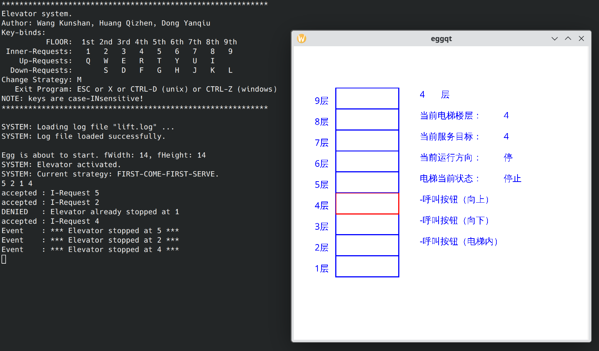

# EggQt: Easy Graphical egG, re-implemented in Qt6

*TL;DR: This project exists purely for nostalgia.  Don't use it in production environments.  If you
teach the C programming language, and want an easy-to-use GUI framework as part of a student
project, try GTK or SDL.  If you are a current or past student from the [School of Computer Science,
Beijing University of Posts and Communications](https://scs.bupt.edu.cn/), and you did an assignment
about lift emulation which involved a framework named EGG, you may try to resurrect your assignment
using this project.*

*本项目纯粹是为了怀旧而存在的。不要在生产环境中使用。如果你是教C语言的教师，需要一个易用的图形框架
来设计学生大作业，建议看看GTK和SDL。如果你是[北京邮电大学计算机学院](https://scs.bupt.edu.cn/)的学生
或者校友，而且你以前做过一个关于电梯的大作业，你可以试试用这个项目来复活你的大作业。*

**Easy Graphical egG** (EGG) was originally developed by Sunner (See http://egg.sunner.cn).  It was
an open-source (GPL-licensed) graphics and animation library implemented in C, and it was intended
as an extremely simple and intuitive library for beginner C programmers.

When I was in my first year in university, the C programming language course used this library as
the underlying graphics framework for its final assignment which was a lift emulator.  After many
years, I found the code of my assignment from my hard drive, but I could no longer compile it.  I
only had a copy of the header `egg.h` and a static library `egg.lib` for 32-bit Windows.  Since EGG
was GPL-licensed, I could in theory ask my teacher for the source code.  But after looking at the
header, I thought I could implement the library by myself.

And I did it.  Here is a screenshot of the resurrected lift project.  It is not open-source because
current students may still be doing the same assignment.  (p.s. I have no idea why I used both the
British English word 'lift' and the American English word 'elevator' in one project.  Maybe it was
because my English sucks.)



# The implementation

I re-implemented EGG using [Qt6](https://www.qt.io/) as the underlying GUI framework.  Why?  Because
I use KDE on GNU/Linux as my everyday desktop environment, and KDE applications are built on Qt (and
is gradually migrating to Qt6).  I could have used GTK if I were a GNOME user.  SDL is also a viable
framework.

But implementing EGG on top of Qt does impose a few challenges.  Qt uses reactive programming.  The
application enters the main loop after a few initialisations, and it then reacts to different
events, including keyboard and mouse input as well as the requests for re-drawing the window.  But
the EGG API doesn't look reactive at all.  You can have a look at the header
[`egg.h`](./src/include/egg.h).  The EGG API looks as if you can call one function to draw something
on the canvas, and call another function to wait for an event, and things (such as drawing the GUI)
just happen in the background.  Qt and EGG simply do not match.

One intuitive solution is using two threads, one running Qt's main loop, and another running the
user's main function.  But Qt expects the main thread of a process to run the main loop.  EGG
doesn't seem to expose the idea of 'threads' to the user, and we can expect most EGG users will call
EGG API functions from the main thread.

In the end, I used a very dirty hack.  I used [Boost Coroutine2] to multiplex the main thread to do
two things in turn.  The main thread starts with the main coroutine that runs the user's main
function, which is expected to call EGG API functions in sequence.  But when calling any EGG API
function that waits for events (timer, keyboard, mouse, etc.), it switches to another coroutine that
runs Qt's main loop.  When Qt calls back to handle an event, it switches back to the main coroutine
which must be executing an EGG function waiting for an event, and that EGG function returns.  Boost
Coroutine2 implements stackful coroutines, and each coroutine has its own execution stack (read
[this blog post][blog-coroutine] if you want to know more about coroutines).  This means both
coroutines can be in the middle of nested function calls when switching coroutines.  This behaves
somewhat like multi-threaded programs, except coroutines yield at deterministic locations.  By doing
so, we can hide Qt's main loop away from the user's line of sight, allowing the user to write a
single-threaded program and pretend the GUI simply draws itself in the background.

[Boost Coroutine2]: https://www.boost.io/libraries/coroutine2/
[blog-coroutines]: https://wks.github.io/blog/2022/09/22/coroutine-flatten.html#c-boostcoroutine2-stackful-asymmetric

# But EGG still sucks

In my opinion, EGG is still a work in progress.  At least the version I received from my teacher
was.  There is no way to erase things.  Once things are drawn, you can't remove it from the canvas.
Although EGG was designed as an 'animation library', the ability to move 'eggs' (layers) makes it
barely capable of showing moving pictures.  If you want something to disappear, the only way to do
it is drawing something new over the old pixels.  In the lift emulator assignment, we needed a way
to show the current floors scheduled which can change as the program runs.  Using EGG, we just
called `DrawString` to draw the new text at the same coordinate.  The `DrawString` function paints
the text background white, overwriting the old text.  This is probably the behaviour of the Windows
API function the original EGG library used to implement `DrawString`.  When re-implementing EGG on
Qt, I had to deliberately paint a white rectangle over the region where text is drawn because Qt's
`QPainter::drawText` function draws text with transparent background.  By doing this, we barely made
the lift emulator implementable because the only thing that moves is the rectangle that represents
the lift, and the only thing that changes is the text.  EGG can't even draw a rectangle filled with
solid colour.  We can't imagine making a dancing character because we need to draw the figure frame
by frame.  We can't make a shooting game because we need to create many bullets and delete them when
they hit.  The lack of erasing operations limits the usefulness of the EGG library.

And it is interesting that EGG supports mouse movement events, but not mouse button events.

And the coordinate system is weird.  The origin is at the bottom-left corner of the window, and the
y-axis goes up.  But when moving an 'egg' (i.e. a layer), the `MoveEgg` function expects the
coordinate where the *top-left corner* of the layer is placed!  Moreover, when drawing text, the
`DrawString` function expects the coordinate of the top-left corner of the text.  It is just so
inconsistent.

So if any professor or lecturer wants to design another course assignment that involves graphics
programming, I won't recommend EGG at all.  Just use a well-known GUI framework, such as GTK+ or Qt,
and stick to the reactive programming style.  Alternatively, use SDL which is designed for game
development, and the lift emulator is somewhat like a game.

# How to use it?

EggQt depends on Qt6, Boost and [fmt], and uses the cmake build system.  Install them using the
package manager of your GNU/Linux distribution.

[fmt]: https://fmt.dev/

Make a directory, configure it with `cmake`, and then build, and then install.

```
mkdir build-debug
cd build-debug
cmake .. -G Ninja -DCMAKE_INSTALL_PREFIX=$PWD/install
cmake --build .
./src/example/hello
```

This will build the library and examples, and run the example program `hello`.

```
cmake --install .
```

This will install the shared library and header file in `eggqt/build-debug/install`.  You may choose
a different location by changing the variable `CMAKE_INSTALL_PREFIX`.

## Add your own project

The easiest way to compile your own EGG application against EggQt is modifying an existing example
in `eggqt/src/examples`.  You can also add another `.c` file in `eggqt/src/examples` and add it to
`eggqt/src/example/CMakeLists.txt`.

You can also put your source code in your own directory.  The only public header is
`eggqt/src/include/egg.h`, and you link your program against the generated `libeggqt.so`.

If you use cmake, too, add `find_package(EggQt REQUIRED)` to your `CMakeLists.txt`, and set
`CMAKE_PREFIX_PATH` to the `CMAKE_INSTALL_PREFIX` you configured for EggQt, so that cmake can find
EggQt.

# Author

Kunshan Wang (wks1986 AT gmail DOT com)

EGG was originally developed by Sunner (https://egg.sunner.cn/)

<!--
vim: ts=4 sw=4 sts=2 et tw=100
-->
